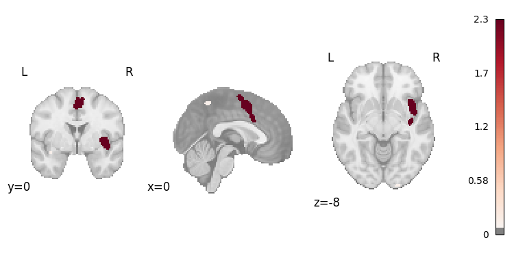

# GPU wrapper for NiMARE

This package is a GPU wrapper for NiMARE that can run ALE (and MA maps) calculations more efficiently on GPUs. Currently only ALE and SCALE are implemented. The calculations are parallelized across experiments and the foci, with the option to also parallelize across batches of permutations. GPU parallelization is most beneficial in running many ALE permutations, e.g. in Monte Carlo Family-Wise Error multiple comparisons correction of ALE or the permutations of SCALE.

## Installation
1. Install the correct version of CuPy according to the version of Nvidia Toolkit installed on your machine. [See CuPy's installation guide](https://docs.cupy.dev/en/stable/install.html#installing-cupy).

2. Install `nimare-gpu` via `pip install git+https://github.com/amnsbr/nimare-gpu.git`

## Example
```python
import os
import numpy as np
from nimare_gpu.ale import DeviceALE
from nimare.correct import FWECorrector
from nimare.dataset import Dataset
from nimare.extract import download_nidm_pain
from nimare.utils import get_resource_path
from nilearn.plotting import plot_stat_map

# load an example dataset
dset_dir = download_nidm_pain()
dset_file = os.path.join(get_resource_path(), "nidm_pain_dset.json")
dset = Dataset(dset_file, target="mni152_2mm", mask=None)

# set random seed
np.random.seed(0)

# run ALE
meta = DeviceALE()
res = meta.fit(dset)

# run Monte Carlo FWE
fwe = FWECorrector(method="montecarlo", voxel_thresh=0.001, n_iters=100)
cres = fwe.transform(res)

# plot the result
plot_stat_map(
    cres.get_map("z_desc-size_level-cluster_corr-FWE_method-montecarlo"),
    cut_coords=[0, 0, -8],
    draw_cross=False,
    cmap="RdBu_r",
    threshold=0.1,
)
```
